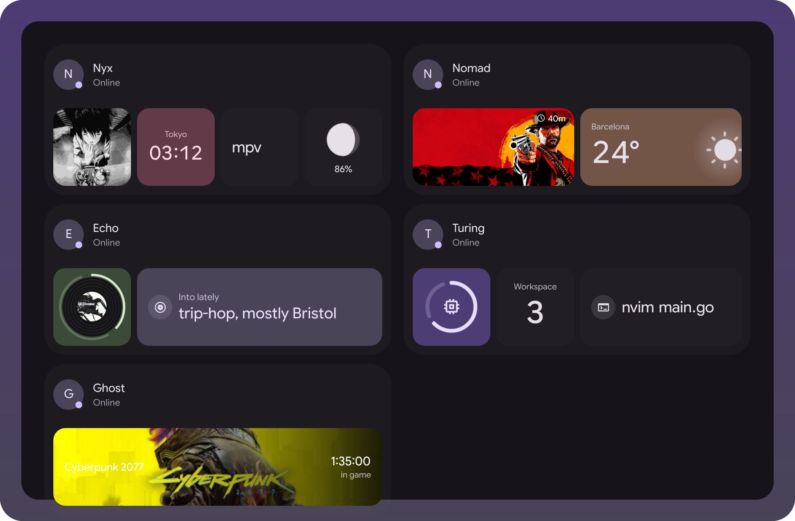
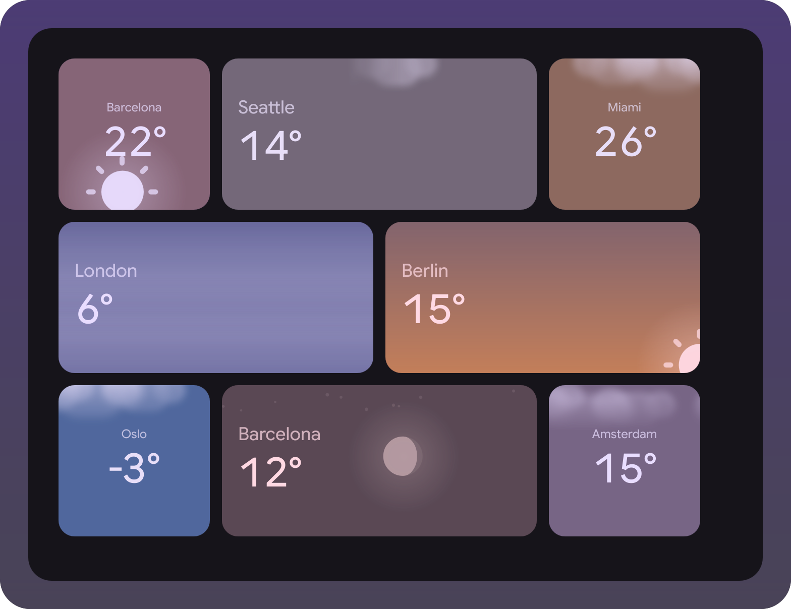
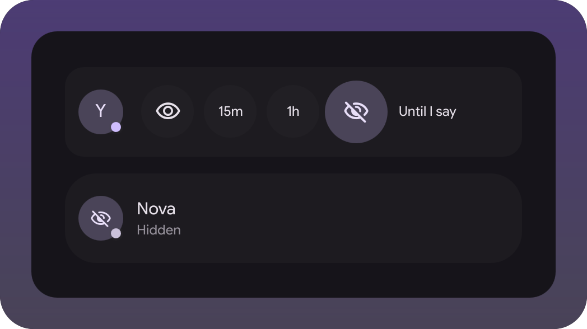
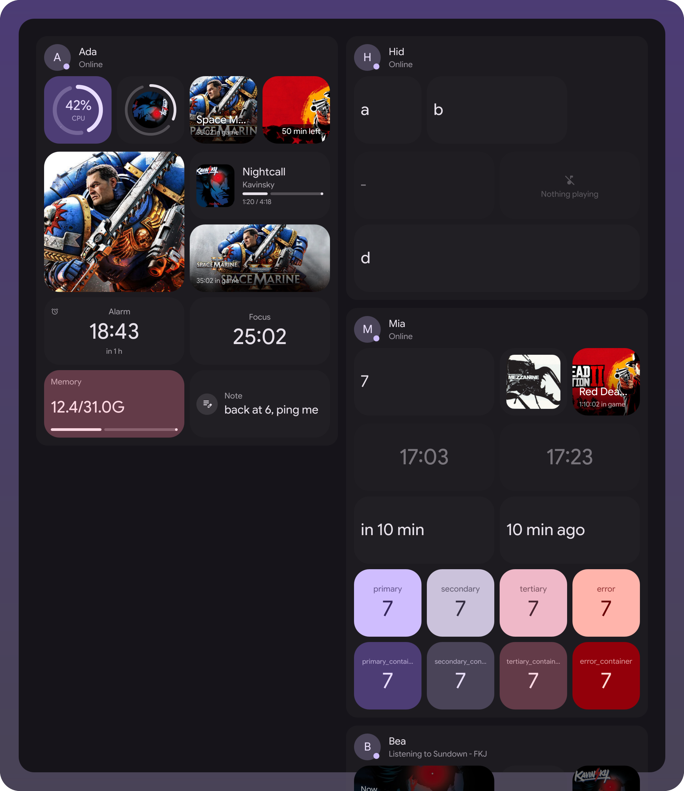
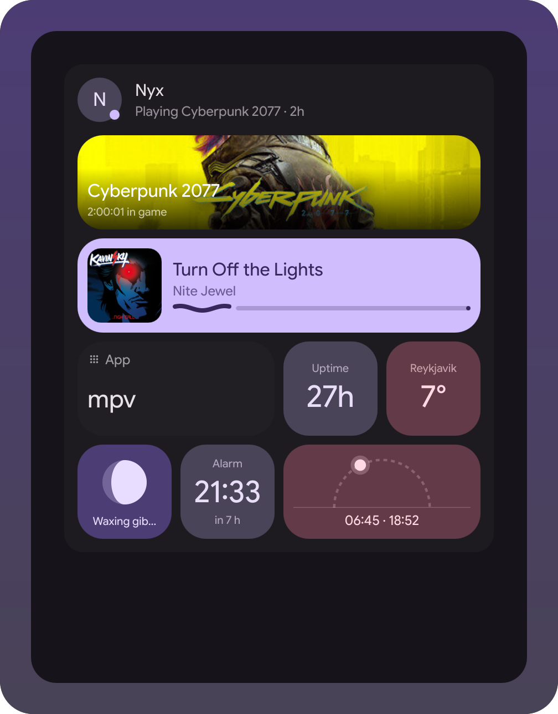
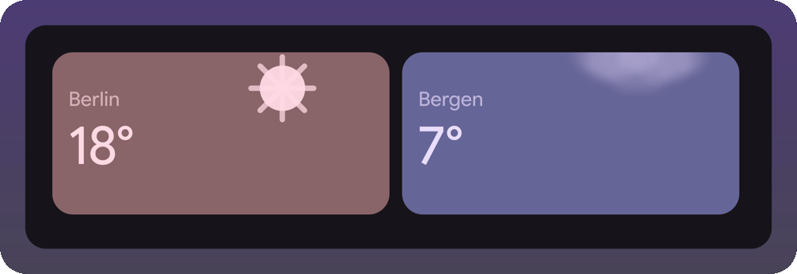

# Fresence widget

A room of friends on your desktop: who's online, what they're playing, photos they
shared. Client for [fresence](https://github.com/Berupor/fresence), and the first
widget living outside the shell tree - a trial run of the extensions mechanism in the
[illogical-impulse extensions fork](https://github.com/Berupor/dots-hyprland-extensions).



Nobody in that room is real: the scenes in `demo/` feed the widget made-up snapshots
through the same `ingest` that `fresence watch` talks to.

<table>
<tr>
<td align="center" width="50%">
<br>
<sub>Clear, rain, thunder, snow, fog, a sunset, night with the moon</sub>
</td>
<td align="center" width="50%">
<br>
<sub>Sliding into hiding, and how it looks to everyone else</sub>
</td>
</tr>
<tr>
<td align="center">
<br>
<sub>Every kind of tile a card can hold</sub>
</td>
<td align="center">
<br>
<sub>A night owl's card, close up</sub>
</td>
</tr>
</table>

<p align="center">
<br>
<sub>The same live tiles, moving: the sun runs its arc through sunset, past it into night with the moon, and back round to noon, a thunderstorm rains and flashes</sub>
</p>

## Install

Settings → Widgets → Install a widget, paste:

```
https://github.com/Berupor/ii-widget-fresence.git
```

Needs the fresence agent installed on this machine as its systemd user unit. Until it
runs and is linked, the Room tab says what is missing: it starts the unit, and takes a
`fresence://` code pasted into it, an invite from a friend or a code from "Link a device"
on your other device. The widget holds no keys and never talks to the server: the room
comes from `fresence watch`, joining and linking go through `fresence join` and
`fresence link`, hiding and sharing through `fresence incognito` and `fresence photo`, card
settings through `fresence config write` and `fresence chess`, new rooms through `fresence room create`.

What a card shows is up to its owner: the `row` and `detail` grids of each device live
in the agent's config. The widget's settings have a My card tab that edits this device's
grids the same way the fresence app does, and the widget draws every card by the rules in
fresence's `protocol.md`.

## Hacking

With the fork checked out next door, the scenes are both the tests and the pictures:

```sh
tests/qml-cases.sh    -x ~/.config/illogical-impulse/widgets/fresence
tests/widget-shots.sh -x ~/.config/illogical-impulse/widgets/fresence
tests/widget-gif.sh                                   # redraws docs/weather.gif
```

`git config core.hooksPath .githooks` runs them on push. GPL-3.0.
